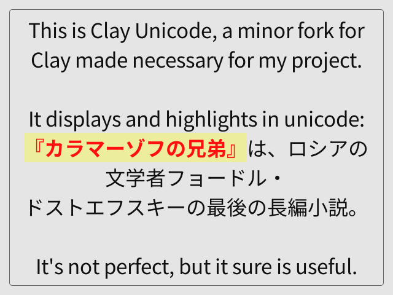

# Clay_Unicode
It *(almost)* works the same as Clay.

## Instructions
Consult `example.c`, compile with `gcc example.c -lraylib`, modify for however you have raylib installed. Squash and stretch as you wish!

---

### Disclaimer
This is an ad-hoc expansion I made for something I was working on, expect weird/profane comments, sudden reformatting, temporary variables with no names, unused libraries included, et cetera. This was made *for me* and is in no way a polished development experience. I also have not modified any Clay renderer besides the raylib one. *Clay_Unicode exists to serve my ends and be learned from, not necessarily replicated.* I also made and developed this between August and October '25, so if Clay supports unicode now, my bad.

### Important notes
- This was a "fork" of the [Clay UI Library](https://github.com/nicbarker/clay/) with a [raylib example](https://github.com/raysan5/raylib/blob/master/examples/text/text_unicode_emojis.c) shoehorned in originally, until I rewrote it to add text alignment. There are still remnants...
- If you put this mod into actual use, consider viewing this [raylib example](https://github.com/raysan5/raylib/blob/master/examples/text/text_codepoints_loading.c) demonstrating loading less than 40960 glyphs into memory. I just did it dirty to keep the example topical.
- If someone who works on Clay sees this, I had no idea about the custom features stuff, or how to use it. My apologies overtly mangling the code.
- The intellectual property is that of its respective owners. If I infringed on your license blow me.

### Documentation
If I took something from Clay and forced it to take a dynamic variable that's my bad. Basically it adds the struct `Clay_Unicode` in clay.h, `Clay_RectangleRenderData` has some extra stuff in it, and in the final layout calculation at the `emitRectangle` check, it injects the userdata into the rectangle. I did not make any special element for it, that much I apologize for, I don't think documentation existed at the time. Core maintainers of Clay, take note of how codepoints are used, do not take inspiration from how I defiled the source code.

---

## Further info
- `NotoSansJP-Bold.otf` and `NotoSansJP-Bold.otf` are dependencies for the example.
- `clay.h` and `clay_renderer_raylib.c` are still imported the exact same way.
- `unicodebox.c` was to segregate most of my rendering changes from `clay_renderer_raylib.c`.
- `example.c` is a boilerplate example to show you how the main feature works.